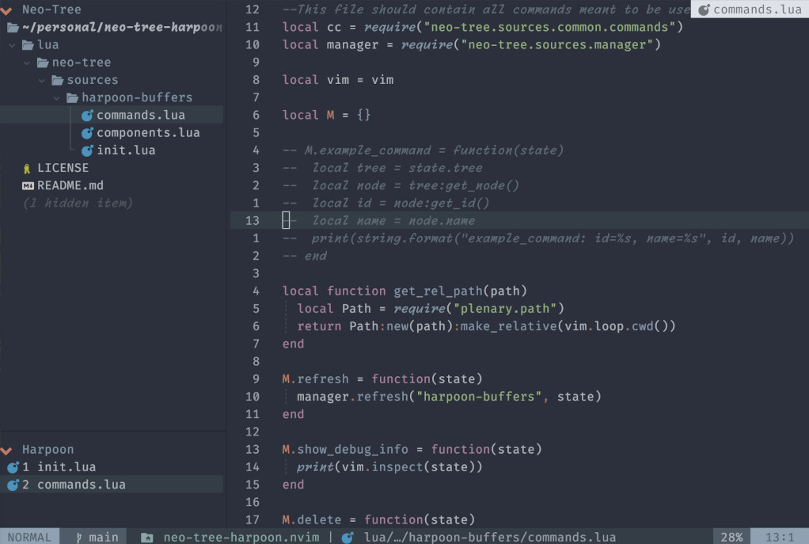

# neo-tree-harpoon.nvim

_Status_: usable [TODO](#TODO)

Show Harpoon buffers in a neo-tree panel



## Install

Install via lazy.nvim:

Example:

```lua
  {
    "nvim-neo-tree/neo-tree.nvim",
    branch = "v3.x",
    dependencies = {
      "nvim-lua/plenary.nvim",
      "nvim-tree/nvim-web-devicons", -- not strictly required, but recommended
      "MunifTanjim/nui.nvim",
      "3rd/image.nvim",              -- Optional image support in preview window: See `# Preview Mode` for more information
      "jackielii/neo-tree-harpoon.nvim"
    },
    cmd = "Neotree",
    opts = {
      sources = { "filesystem", "buffers", "git_status", "document_symbols", "harpoon-buffers" },
  }
```

Add edgy to fix the position of the harpoon-buffers panel in the tree.:

```lua
  {
    "folke/edgy.nvim",
    event = "VeryLazy",
    opts = {
      keys = {
        ...
      },
      left = {
        {
          title = "Harpoon Buffers",
          ft = "neo-tree",
          filter = function(buf)
            return vim.b[buf].neo_tree_source == "harpoon-buffers"
          end,
          pinned = true,
          open = "Neotree position=top harpoon-buffers",
          size = { height = 0.2 },
        },

	...
```

## TODO

- [ ] delete action `d` to remove buffer from harpoon
